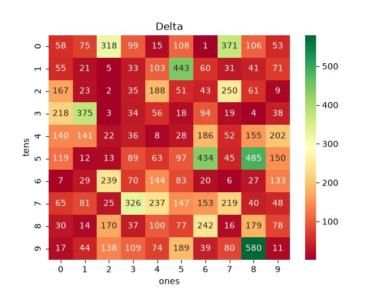
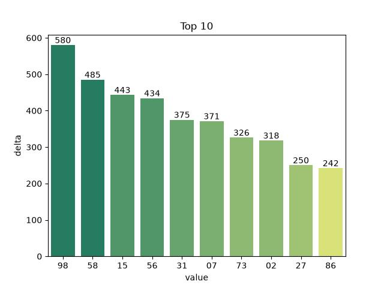
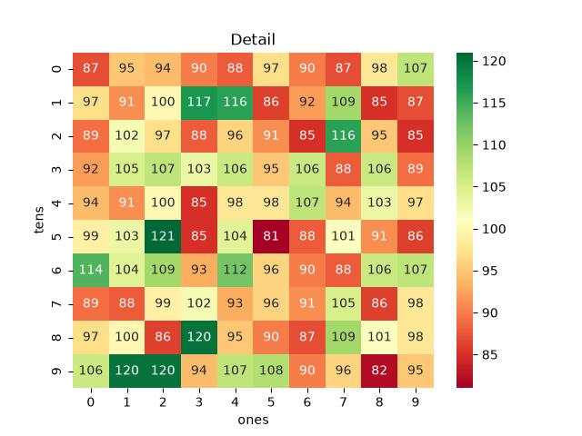
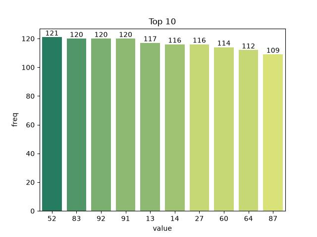
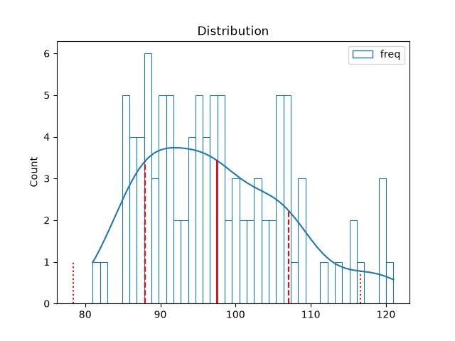
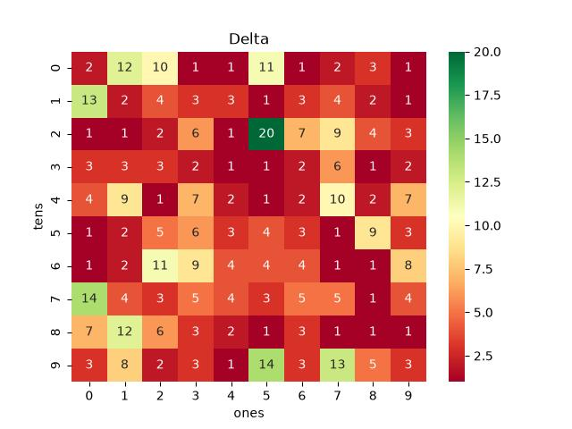
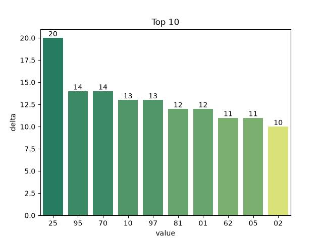

# Vietnam Lottery (XSMB) Analysis

Using GitHub Action to automatically fetch and analyze results of the Vietnam lottery daily.

This project is created by [Khiem Doan](https://github.com/khiemdoan). I create this project for education purpose only. You can use any resource in this repository for free without any permission.

Sử dụng GitHub Action để tự động hoá thu thập và phân tích kết quả xổ số hàng ngày của Việt Nam.

Dự án này được tạo bởi [Khiêm Đoàn](https://github.com/khiemdoan). Tôi tạo dự án này chỉ nhằm mục đích học tập. Bạn có thể sử dụng bất kỳ tài nguyên nào trong kho lưu trữ này một cách miễn phí mà không cần bất kỳ sự cho phép nào.

| Lottery (Xổ số) | Loto (Lô tô) |
| :------------: | :----------: |
| <table><tr><td>Date (Ngày)</td><td>23-09-2026</td></tr><tr><td>Special (Giải đặc biệt)</td><td>76406</td></tr><tr><td>First (Giải nhất)</td><td>23650</td></tr><tr><td>Second (Giải nhì)</td><td>60738, 52745</td></tr><tr><td rowspan="2">Third (Giải ba)</td><td>44485, 42689, 50615</td></tr><tr><td>61435, 30004, 30420</td></tr><tr><td>Fourth (Giải tư)</td><td>9109, 5019, 9268, 2494</td></tr><tr><td rowspan="2">Fifth (Giải năm)</td><td>6524, 1687, 0357</td></tr><tr><td>9642, 0185, 9078</td></tr><tr><td>Sixth (Giải sáu)</td><td>188, 567, 903</td></tr><tr><td>Seventh (Giải bảy)</td><td>34, 21, 60, 89</td></tr></table> | <table><tr><td>First (Đầu)</td><td>Last (Đuôi)</td></tr><tr><td>0</td><td>3, 4, 6, 9</td></tr><tr><td>1</td><td>5, 9</td></tr><tr><td>2</td><td>0, 1, 4</td></tr><tr><td>3</td><td>4, 5, 8</td></tr><tr><td>4</td><td>2, 5</td></tr><tr><td>5</td><td>0, 7</td></tr><tr><td>6</td><td>0, 7, 8</td></tr><tr><td>7</td><td>8</td></tr><tr><td>8</td><td>5, 5, 7, 8, 9, 9</td></tr><tr><td>9</td><td>4</td></tr></table> |

## Data (Dữ liệu)

|          | CSV | JSON | Parquet |
|----------|-----|------|---------|
| Raw      | [xsmb.csv](https://raw.githubusercontent.com/baotrung2107/vietnam-lottery-xsmb-analysis/refs/heads/main/data/xsmb.csv) | [xsmb.json](https://raw.githubusercontent.com/baotrung2107/vietnam-lottery-xsmb-analysis/refs/heads/main/data/xsmb.json) | [xsmb.parquet](https://raw.githubusercontent.com/baotrung2107/vietnam-lottery-xsmb-analysis/refs/heads/main/data/xsmb.parquet) |
| 2-digits | [xsmb-2-digits.csv](https://raw.githubusercontent.com/baotrung2107/vietnam-lottery-xsmb-analysis/refs/heads/main/data/xsmb-2-digits.csv) | [xsmb-2-digits.json](https://raw.githubusercontent.com/baotrung2107/vietnam-lottery-xsmb-analysis/refs/heads/main/data/xsmb-2-digits.json) | [xsmb-2-digits.parquet](https://raw.githubusercontent.com/baotrung2107/vietnam-lottery-xsmb-analysis/refs/heads/main/data/xsmb-2-digits.parquet) |
| Sparse   | [xsmb-sparse.csv](https://raw.githubusercontent.com/baotrung2107/vietnam-lottery-xsmb-analysis/refs/heads/main/data/xsmb-sparse.csv) | [xsmb-sparse.json](https://raw.githubusercontent.com/baotrung2107/vietnam-lottery-xsmb-analysis/refs/heads/main/data/xsmb-sparse.json) | [xsmb-sparse.parquet](https://raw.githubusercontent.com/baotrung2107/vietnam-lottery-xsmb-analysis/refs/heads/main/data/xsmb-sparse.parquet) |

## Using

You can use `curl` or `wget` to download data files. Or you can load them directly into DataFrame:

Bạn có thể sử dụng curl hoặc wget để tải các tệp dữ liệu. Hoặc bạn có thể tải chúng trực tiếp vào DataFrame:

```sh
wget https://raw.githubusercontent.com/baotrung2107/vietnam-lottery-xsmb-analysis/refs/heads/main/data/xsmb.csv
```

```sh
curl -O https://raw.githubusercontent.com/baotrung2107/vietnam-lottery-xsmb-analysis/refs/heads/main/data/xsmb-2-digits.csv
```

```python
import pandas as pd

df = pd.read_csv('https://raw.githubusercontent.com/baotrung2107/vietnam-lottery-xsmb-analysis/refs/heads/main/data/xsmb-sparse.csv')
df.info()
```

<details>
  <summary><h2>Analysis of special prices (Phân tích kết quả xổ số)</h2></summary>
  <h3>Amount of day from last appearing (Số ngày từ lần xuất hiện cuối cùng)</h3>

  

  <h3>Top 10 amount of day from last appearing (Top 10 số lâu chưa xuất hiện)</h3>

  
</details>

<details>
  <summary><h2>Digit tracker (Theo dõi chữ số 0-9 ở 2 số cuối giải đặc biệt)</h2></summary>

Mỗi chữ số nằm trong đúng **19/100** số hai chữ số, nên xác suất mỗi kỳ luôn là **19%** cho cả mười chữ số, và **không đổi** theo chuỗi vắng mặt. Trung bình phải chờ 5.3 kỳ mới có một lần, tính từ kỳ mới nhất chứ không tính ngược lại.

  <h3>Số khan vừa về kỳ này</h3>

Kỳ này không có số khan nào vừa về (ngưỡng: chữ số vắng ≥ 10 kỳ, con số vắng ≥ 230 kỳ).


| Chữ số | Vắng liên tiếp | Lần cuối xuất hiện | Độ hiếm của chuỗi |
|:------:|:--------------:|:------------------:|:-----------------:|
| 5 | 11 kỳ | 12-09-2026 | 9.85% |
| 9 | 8 kỳ | 15-09-2026 | 18.53% |
| 4 | 7 kỳ | 16-09-2026 | 22.88% |
| 7 | 5 kỳ | 18-09-2026 | 34.87% |
| 1 | 4 kỳ | 19-09-2026 | 43.05% |
| 8 | 3 kỳ | 20-09-2026 | 53.14% |
| 3 | 2 kỳ | 21-09-2026 | 65.61% |
| 2 | 1 kỳ | 22-09-2026 | 81.00% |
| 0 | 0 kỳ | 23-09-2026 | 100.00% |
| 6 | 0 kỳ | 23-09-2026 | 100.00% |

  <h3>Chữ số của giải bảy kỳ mới nhất</h3>

Giải bảy kỳ này: `34`, `21`, `60`, `89` — gồm các chữ số **0**, **1**, **2**, **3**, **4**, **6**, **8**, **9**.

Giải bảy quay trước giải đặc biệt vài phút nên hay bị nghĩ là có liên hệ. Đo trên toàn bộ lịch sử thì không: mỗi chữ số của giải bảy xuất hiện ở 2 số cuối giải đặc biệt đúng 19% số kỳ, bằng đúng mức của một chữ số lấy ngẫu nhiên.

| Chữ số | Vắng liên tiếp | Lần cuối xuất hiện | Độ hiếm của chuỗi |
|:------:|:--------------:|:------------------:|:-----------------:|
| 9 | 8 kỳ | 15-09-2026 | 18.53% |
| 4 | 7 kỳ | 16-09-2026 | 22.88% |
| 1 | 4 kỳ | 19-09-2026 | 43.05% |
| 8 | 3 kỳ | 20-09-2026 | 53.14% |
| 3 | 2 kỳ | 21-09-2026 | 65.61% |
| 2 | 1 kỳ | 22-09-2026 | 81.00% |
| 0 | 0 kỳ | 23-09-2026 | 100.00% |
| 6 | 0 kỳ | 23-09-2026 | 100.00% |

  <h3>Chu kỳ A, B của giải bảy thứ nhất</h3>

Biến cố: chữ số **A** (hàng chục) và **B** (hàng đơn vị) của số giải bảy thứ nhất có mặt trong 2 số cuối giải đặc biệt cùng kỳ.

| Biến cố | Tỉ lệ/kỳ | Lượt trúng | Đang trượt | Lần trúng gần nhất | TB cách | Trung vị | 90% ≤ | Dài nhất | Ngưỡng báo |
|:-------:|:--------:|:----------:|:----------:|:------------------:|:-------:|:--------:|:-----:|:--------:|:----------:|
| **Chỉ A** | 19.2% | 1452 | **6 kỳ** | 17-09-2026 | 5.2 kỳ | 4 | 11 | 45 | 15 kỳ |
| **Chỉ B** | 19.2% | 1455 | **1 kỳ** | 22-09-2026 | 5.2 kỳ | 4 | 11 | 34 | 15 kỳ |
| **A hoặc B** | 35.0% | 2643 | **1 kỳ** | 22-09-2026 | 2.9 kỳ | 2 | 6 | 21 | 5 kỳ |

Ngưỡng của **A hoặc B** đặt ở mức báo sớm 5 kỳ theo yêu cầu (độ hiếm ~11,6% — sẽ kêu vài lần mỗi tháng); A và B riêng lẻ theo mức hiếm 5% (15 kỳ). Chạm ngưỡng nghĩa là chuỗi chờ đã dài so với nhịp lịch sử — nó KHÔNG làm kỳ tới dễ trúng hơn.

  <h3>Xác suất cho 7 kỳ tới (đúng cho mọi chữ số)</h3>

| Kỳ tới | Trúng đúng kỳ này (lần đầu) | Đã trúng ít nhất một lần |
|:------:|:---------------------------:|:------------------------:|
| 1 | 19.00% | 19.00% |
| 2 | 15.39% | 34.39% |
| 3 | 12.47% | 46.86% |
| 4 | 10.10% | 56.95% |
| 5 | 8.18% | 65.13% |
| 6 | 6.62% | 71.76% |
| 7 | 5.37% | 77.12% |

Cột phải tăng dần chỉ vì càng nhiều kỳ thì càng nhiều lượt quay, **không phải** vì chờ lâu thì dễ ra hơn. Công thức: `P(n kỳ tới đều trượt) = 0,81 ^ n`, chỉ đếm kỳ chưa quay — cộng cả kỳ đã trượt vào số mũ là sai.
</details>

<details>
  <summary><h2>Analysis of one-year Loto results (Phân tích kết quả lô tô trong 1 năm)</h2></summary>

  Max: 121. Min: 81.

  Mean: 97.47. Standard deviation: 9.55.

  <h3>Detail (Chi tiết)</h3>

  

  <h3>Top 10</h3>

  

  <h3>Distribution (Phân bổ)</h3>

  
</details>

<details>
  <summary><h3>Amount of day from last appearing (Số ngày từ lần xuất hiện cuối cùng)</h2></summary>

  

  <h3>Top 10 amount of day from last appearing (Top 10 số lâu chưa xuất hiện)</h3>

  
</details>